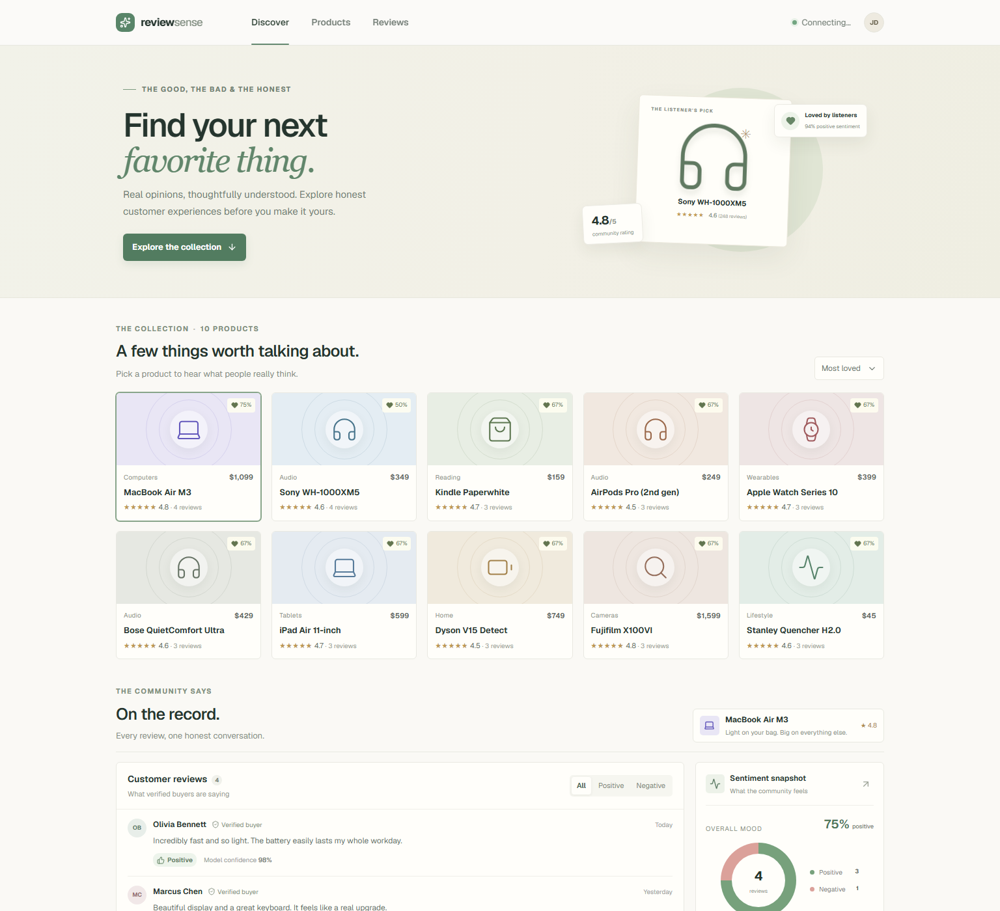

# ReviewSense

ReviewSense is a product review discovery and sentiment analysis dashboard. Browse a curated collection of products, read customer feedback, and see an at-a-glance breakdown of positive and negative sentiment. The companion Python API classifies submitted reviews and stores products and reviews in SQLite.

## Website



## Features

- Browse and sort a collection of products across several categories.
- Read product reviews and filter them by sentiment.
- Submit a review and receive a sentiment prediction with a confidence score.
- View sentiment summaries and review analytics for each product.
- Load review data from the bundled CSV dataset.

## Run locally

### Web app

Install the JavaScript dependencies and start the development server:

```powershell
npm install
npm run dev
```

### Python API

In another terminal, install the API dependencies and start the service:

```powershell
python -m pip install -r backend/requirements.txt
python -m uvicorn backend.main:app --reload --port 8000
```

The web app uses `http://127.0.0.1:8000` by default. Set `NEXT_PUBLIC_REVIEWSENSE_API_URL` to use another API URL. The API health endpoint is `GET /api/health`; products and saved reviews are available from `GET /api/products`, and reviews can be submitted to `POST /api/products/{product_id}/reviews`.

## Sentiment model

The API trains a TF-IDF and Logistic Regression classifier from the included product review dataset. One- and two-star reviews are treated as negative, four- and five-star reviews as positive, and neutral three-star reviews are omitted from binary training. The trained model is saved locally as `backend/sentiment-model.joblib`.

See [backend/README.md](backend/README.md) for API and dataset details.
